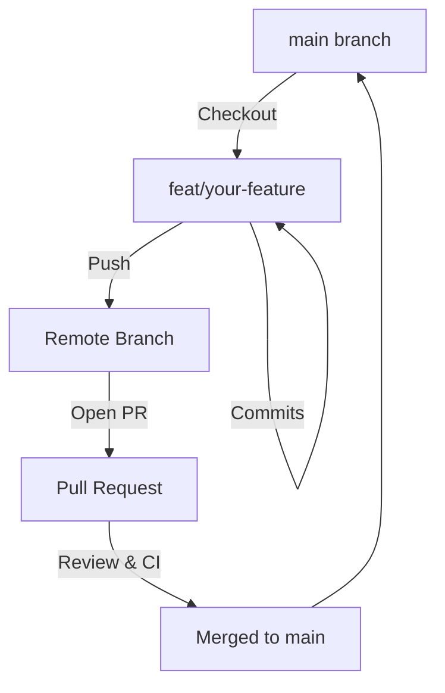

# Contributing to RemitLend

First off, thank you for considering contributing to RemitLend! It's people like you who make RemitLend a powerful tool for providing fair lending access to migrant workers worldwide.

This document provides a set of guidelines for contributing to RemitLend and its packages. These are mostly guidelines, not rules. Use your best judgment, and feel free to propose changes to this document in a pull request.

## 📋 Table of Contents

- [Code of Conduct](#code-of-conduct)
- [Development Workflow](#development-workflow)
- [Branching Strategy](#branching-strategy)
- [Commit Message Guidelines](#commit-message-guidelines)
- [Pull Request Standards](#pull-request-standards)
- [Testing Requirements](#testing-requirements)
- [Style Guides](#style-guides)

## Code of Conduct

By participating in this project, you agree to maintain a respectful, inclusive, and harassment-free environment for everyone. We are committed to providing a welcoming experience for contributors of all backgrounds and skill levels.

## Development Workflow

We follow a **Feature-Branch-to-Main** workflow. All development work should happen in feature branches and be merged into `main` via Pull Requests.

### Architecture & Contributor Wiki

If you're new to the codebase, start with:
- `docs/wiki/README.md` (high-level contributor wiki)
- `ARCHITECTURE.md` (system overview).



### Steps to Contribute

1. **Fork & Clone**: Fork the repository and clone it locally.
2. **Branch**: Create a new branch from the latest `main`.
3. **Develop**: Implement your changes, following code style and quality standards.
4. **Test**: Ensure all tests pass (see [Testing Requirements](#testing-requirements)).
5. **Commit**: Use [Conventional Commits](#commit-message-guidelines).
6. **Push & PR**: Push your branch and open a Pull Request against `main`.

## Branching Strategy

Follow these naming conventions for your branches:

| Type | Prefix | Example |
| :--- | :--- | :--- |
| **Feature** | `feat/` | `feat/lender-dashboard` |
| **Bug Fix** | `fix/` | `fix/nft-minting-error` |
| **Docs** | `docs/` | `docs/update-api-guide` |
| **Refactor** | `refactor/` | `refactor/loan-logic` |
| **Performance**| `perf/` | `perf/optimize-queries` |
| **Maintenance**| `chore/` | `chore/update-deps` |

## Commit Message Guidelines

We strictly follow the [Conventional Commits](https://www.conventionalcommits.org/) specification.

**Format**: `<type>(<scope>): <subject>`

### Common Types:

- **feat**: A new feature (corresponds to `MINOR` in Semantic Versioning).
- **fix**: A bug fix (corresponds to `PATCH` in Semantic Versioning).
- **docs**: Documentation only changes.
- **style**: Changes that do not affect the meaning of the code (white-space, formatting, etc).
- **refactor**: A code change that neither fixes a bug nor adds a feature.
- **perf**: A code change that improves performance.
- **test**: Adding missing tests or correcting existing tests.
- **chore**: Changes to the build process or auxiliary tools and libraries.

**Example**: `feat(contracts): add flash loan prevention to lending pool`

## Pull Request Standards

When opening a PR, ensure your description includes:
- **Linked Issue**: Close the relevant issue (e.g., `Closes #123`).
- **Description**: A clear summary of the changes.
- **Testing**: Evidence that the changes were tested.
- **Checklist**:
    - [ ] Code follows project style guides.
    - [ ] Tests have been added/updated and pass.
    - [ ] Documentation has been updated.
    - [ ] Commit messages follow standards.

## Testing Requirements

Before submitting, verify your changes by running:

### Frontend (Next.js/React)
```bash
cd frontend
npm run lint
npm run test
```

### Backend (Node/Express)
```bash
cd backend
npm run lint
npm run test
```

### Contracts (Soroban/Rust)
```bash
cd contracts
cargo fmt --check
cargo clippy
cargo test
```

## Style Guides

- **TypeScript**: Use functional components and hooks. Prefer `interface` over `type`. Ensure strict typing.
- **Rust**: Follow standard Rust naming conventions and maintain idiomatic code.

---
Thank you for contributing to RemitLend! 🚀
